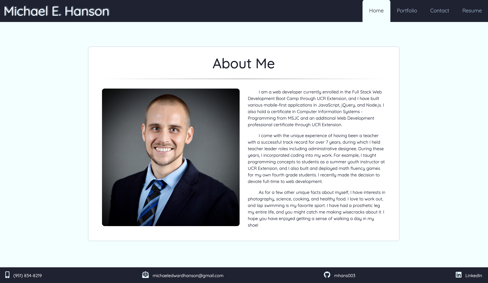
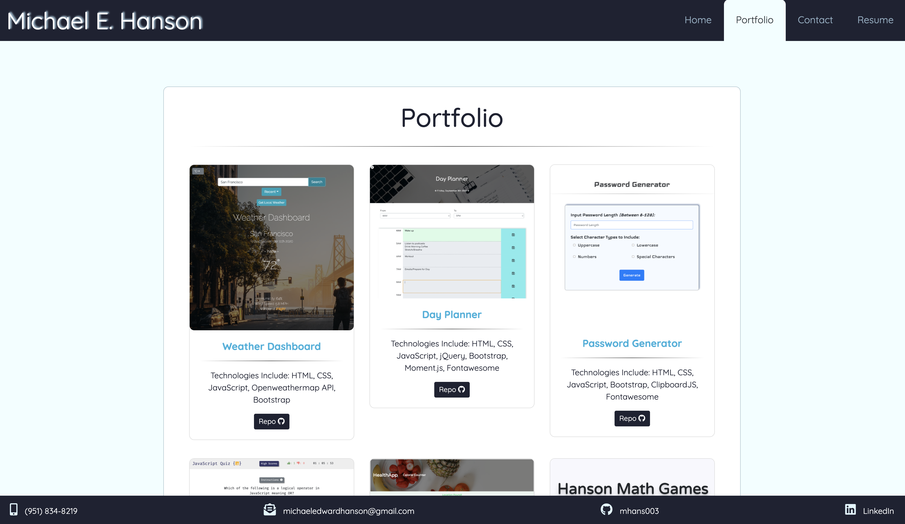

# Michael Hanson's Portfolio (React Version)

## Deployed Application 

[React Portfolio - Michael Hanson](https://michaelhanson-react-portfolio.herokuapp.com/)

## Description

This is Michael Hanson's online portfolio, built using React. 

This mobile-first website contains Michael Hanson's bio, contact information, and portfolio of web development work. 

## Features

* Built using React and utilizing React components
* React Router used to serve pages
* Bootstrap 4 components including grid, navbar, cards, and modals 
* Responsive to a wide variety of screen sizes using Bootstrap and supporting Media Queries

## Contact

Michael Hanson
* michaeledwardhanson@gmail.com
* [GitHub](https://github.com/mhans003)
* [LinkedIn](https://www.linkedin.com/in/michaeledwardhanson/)

## License

Licensed under the [MIT License](./LICENSE.txt).
